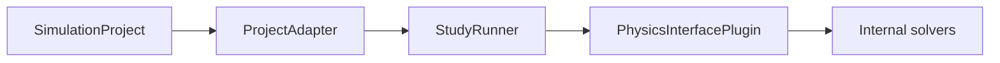

# AutoSim v2 Architecture

## Overview

AutoSim v2 organizes simulations as **SimulationProject** documents (`schema_version: "2.0"`) with a fixed three-root model tree:

1. **Model** — geometry, mesh, materials, physics interfaces, boundary conditions
2. **Simulation (Studies)** — study type, solver sequence, agent, study parameters
3. **Results** — output variables and visualization recipes

Execution flows through plugins, not model-specific API branches:

## Core Types

| Type | Module | Role |
|------|--------|------|
| `SimulationProject` | `project/schemas.py` | Root document |
| `PhysicsInterfacePlugin` | `plugins/physics/` | Build input, run, filter outputs |
| `StudyRunner` | `plugins/studies/` | Dispatch by `study.study_type` |
| `ProjectAdapter` | `api/adapters/project.py` | Sole public API adapter |

## Registered Plugins

| ID | Category | Studies |
|----|----------|---------|
| `semiconductor_1d_poisson` | semiconductor | stationary, bias_sweep, cv_sweep, … |
| `semiconductor_1d_dd` | semiconductor | stationary, bias_sweep, time_dependent, optimization |
| `mechanics_0d_falling_body` | mechanics | time_dependent, parameter_sweep |

## Study Types

| Type | PN | Falling Block |
|------|----|---------------|
| `stationary` | Single Poisson/depletion solve | — |
| `bias_sweep` | Bias scan + sweep curves | — |
| `cv_sweep` | C-V differential capacitance | — |
| `time_dependent` | Transient DD | RK4 trajectory |
| `optimization` | Design optimization | — |
| `parameter_sweep` | Multi-trial agent iteration | Multi-trial iteration |

## Result Protocol

All runs normalize to `UnifiedRunResult`: profiles, time_series, sweep, convergence, probes, decisions, validation, trials.

Visualizations are declared in `project.results.visualizations`; the frontend renders charts generically from `chart_type` and bindings.

## Entry Points

- **API:** `POST /api/runs { "project": { ... } }`
- **CLI:** `autosim run --project examples/projects/demo_pn_si_equilibrium_v2.json`
- **Frontend:** Project template selector + import/export SimulationProject JSON

Legacy `GET /api/models` and `{ model_id, config }` runs return **410/400**.
